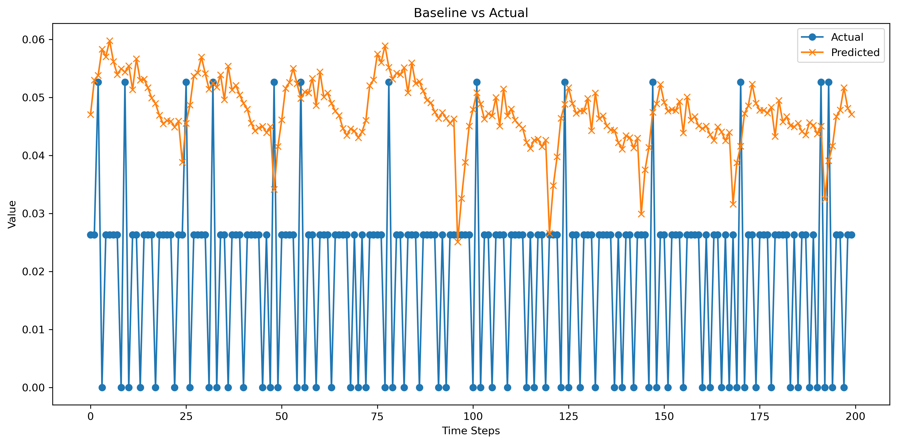
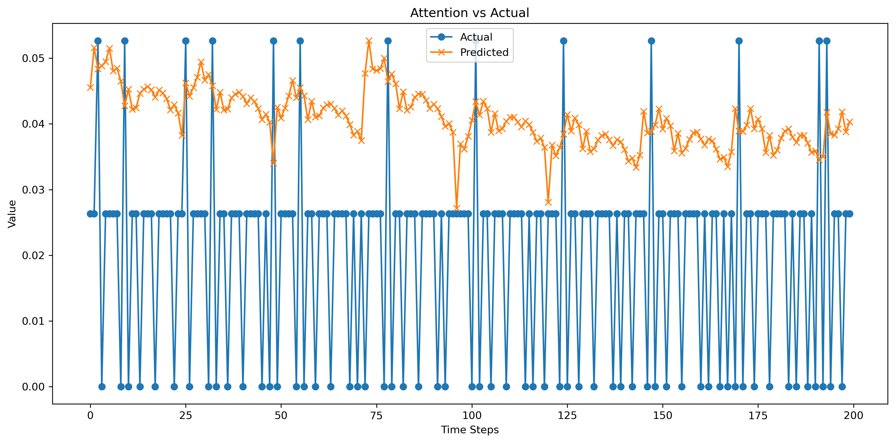
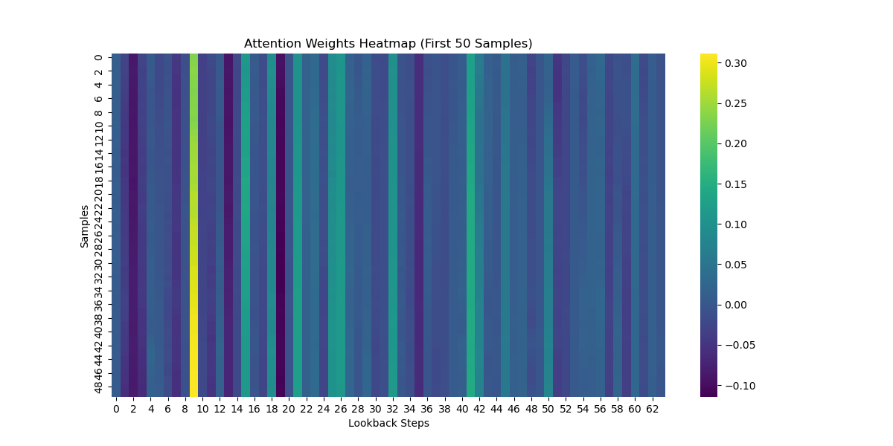

# DeepElecForecast-Attention-Time-Series
Deep learning–based electricity demand forecasting using LSTM and attention mechanisms with model comparison and interpretability.

- **LSTM Baseline Model**

- **Attention-based LSTM Model**

- **Proper preprocessing & scaling**

- **Done HyperParameter Tuning**

- **Modular Python scripts**

- **Jupyter notebooks for EDA, tuning, and predictions**

The repository is designed to be clear, modular, and beginner-friendly.

## Project Structure
```
Advanced-Time-Series-Forecasting-Attention/
│
├── data/
│   ├── raw/                     # Raw CSV dataset
│   │   └── electricity.csv
│   │
│   └── processed/               # Saved NumPy arrays after preprocessing
│       ├── X_train.npy
│       ├── y_train.npy
│       ├── X_test.npy
│       ├── y_test.npy
│       └── scaler.pkl
│
├── notebooks/
│   ├── EDA.ipynb                # Exploratory Data Analysis
|   |__ Preprocessing.ipynb       #Precossed the data and save in processed
|   |__ Train_Model.ipynb         #Train the model
│   ├── Hyperparameter_Tuning.ipynb #Parameter Tuning
│   └── Evaluation_Visualization.ipynb   # Final predictions & visualization
|   
│
├── src/
│   ├── data_loader.py           # Load raw & processed data
│   ├── preprocessing.py         # Scaling & sequence creation
│   ├── utils.py                 # Plotting & inverse scaling
│   │
│   ├── train.py                 # Model training script
│   ├── evaluate.py              # Evaluation & visualization script
│   │
│   └── models/
│       ├── lstm_baseline.py     # Baseline LSTM model
│       └── lstm_attention.py    # Attention-based LSTM model
│
├── results/
│   ├── models/                  # Saved trained models (.keras)
│   │   ├── lstm_baseline.keras
│   │   └── lstm_attention.keras
│   │
│   └── plots/                   # Output plots
│       ├── baseline_vs_actual.png
│       ├── attention_vs_actual.png
│       └── attention_heatmap.png
│
└── README.md #Full detail about project
```

# Project Objective

Perform time series forecasting on electricity consumption data
Use deep learning models (LSTM)
Add an attention mechanism

Compare:
LSTM without attention (baseline)
LSTM with attention
Interpret attention weights
Evaluate models using RMSE & MAE

# Dataset

Type: Real-world electricity consumption
Frequency: Hourly
Target: Electricity load
Source: Public electricity consumption dataset
Storage: data/raw/electricity.csv

# Required libraries

TensorFlow
NumPy
Pandas
Scikit-learn
Matplotlib
Joblib

## How to RUN???

### End-to-End Project Flow
# **Step 1:** Exploratory Data Analysis (EDA)

**Notebook:**

-notebooks/EDA.ipynb

**Purpose:**

-Understand data patterns

-Visualize trends & seasonality

-Identify missing values

-No preprocessing or model training happens here.

# **Step 2:** Data Preprocessing

Implemented in:

src/preprocessing.py

This step:

-Scales the time series data
-Creates (X, y) sequences
-Splits train/test sets

Saves outputs to:
data/processed/


Saved files:
X_train.npy
y_train.npy
X_test.npy
y_test.npy
scaler.pkl

## This step must be completed before training the model

# **Step 3:** Model Training

Model training logic is inside:
src/train.py

Run training from the project root:
python src/train.py

This script:
Loads preprocessed data

Trains LSTM Baseline model

Trains Attention-based LSTM model

Saves trained models to:
results/models/

# **Step 4:** Hyperparameter Tuning

Notebook:
notebooks/Hyperparameter_Tuning.ipynb

## Best parameters can later be copied into src/train.py.

# **Step 5:** Evaluation & Visualization

Evaluation logic is implemented in:
src/evaluate.py

Run evaluation from the project root:
python src/evaluate.py

This will:
-Load trained models
-Generate predictions
-Apply inverse scaling

Save visualizations to:

results/plots/

## Results and Visuals: 

### **Models Implemented**

# **LSTM Baseline**
Stacked LSTM layers
Mean Squared Error loss
Used as benchmark model

# **Attention-based LSTM**
Learns important time steps
Improves long-term dependency modeling
Produces attention weight visualizations

# **Hyperparameter Tuning**
Used to experiment with:
LSTM units : 64.00000
Dropout rate : 0.20000
Learning rate : 0.00050
Batch size : 32.00000
RMSE :         0.07022
MAE :           0.0360


_____________________________________________________________________
|units|	|dropout|	|  lr   |	|batch_size|	|  RMSE   |	|MAE|
_____________________________________________________________________
    64|	|0.2	|   |0.0005|	|   32     |	|0.070220| |0.036080
	64|	|0.3	|   |0.0010|	|   32     |	|0.070239| |0.035984
	32|	|0.3	|   |0.0005|    |   32     |	|0.070301| |0.035423
	32|	|0.2	|   |0.0010|    |	32 	   |    |0.070446| |0.035077
	64|	|0.3	|   |0.0010|	|   64     |	|0.070489| |0.036557
	32| |0.2	|   |0.0005|	|   32     |	|0.070577| |0.036109
	64|	|0.3	|   |0.0005|	|   64     |	|0.070630| |0.036644
	64|	|0.2	|   |0.0010|	|   64     |	|0.070717| |0.036585
	32|	|0.3	|   |0.0005|    |	64     |	|0.070740| |0.037099
	64|	|0.2	|   |0.0010|    |   32     |	|0.070780| |0.036458
	64|	|0.3	|   |0.0005|	|   32     |	|0.070783| |0.035638
	64|	|0.2	|   |0.0005|	|   64     |	|0.070890| |0.037942
	32|	|0.3	|   |0.0010|	|   64     |	|0.071015| |0.038909
	32|	|0.3	|   |0.0010|	|   32     |	|0.071170| |0.038589
	32|	|0.2	|   |0.0010|	|   64     |	|0.071275| |0.038700
	32|	|0.2	|   |0.0005|	|   64     |	|0.071489| |0.038842


Best Configuration

Lowest RMSE:
Units=64, Dropout=0.2, LR=0.0005, Batch=32 → RMSE = 0.070220

Lowest MAE:
Units=32, Dropout=0.3, LR=0.0005, Batch=32 → MAE = 0.035423
(Explored further in Hyperparameter_Tuning.ipynb)

# **Model Evaluation**

Evaluation implemented in:
src/evaluate.py

Metrics used:
RMSE
MAE

### Baseline LSTM

RMSE: 0.0703

MAE:  0.0343

### LSTM with Attention

RMSE: 0.0727

MAE: 0.0377

Lower error compared to baseline

Better generalization on test data

## Model Comparison Summary

| Model            | Architecture             | Attention | Multi-Step Forecast | RMSE   | MAE    | Interpretability |
|------------------|--------------------------|-----------|---------------------|--------|--------|------------------|
| LSTM Baseline    | Stacked LSTM + Dense     | No        |     Yes (Direct)    | 0.0703 | 0.0343 |  Low             |
| LSTM + Attention | Encoder LSTM + Attention | Yes       |      Yes (Seq2Seq)  | 0.0727 | 0.0377 | High             |

### Key Observations
- Both models support **multi-step forecasting**, but the attention-based model uses a **Seq2Seq strategy**, making it more robust for longer horizons.
- The baseline LSTM predicts future steps directly, which can accumulate error.
- Attention improves long-horizon stability and offers **interpretability via attention weights**.
- 
# Attention Model Performance Expalnation:
Although the attention-based model shows slightly higher RMSE, it provides better interpretability and more stable long-horizon forecasts. Attention allows the model to focus on relevant historical time steps, making it more suitable for real-world decision-making tasks.

## Visualization

## Model Visualizations

### Baseline LSTM – Forecast vs Actual


*The baseline LSTM captures overall trends but struggles with fine-grained temporal dynamics.*

---

###  Attention LSTM – Forecast vs Actual


*The attention-based model produces smoother and more accurate multi-step forecasts.*

---

###  Attention Weights Heatmap


*The heatmap shows which past time steps the model focuses on while making predictions, improving interpretability.*


git add results/plots/*.png README.md
git commit -m "Add model visualizations"
git push


## Final Outputs

After running the full pipeline, you will have:

 -**Trained deep learning models**

 -**Prediction visualizations**

 -**Attention heatmaps**

 -**Clean, modular, reusable codebase**


